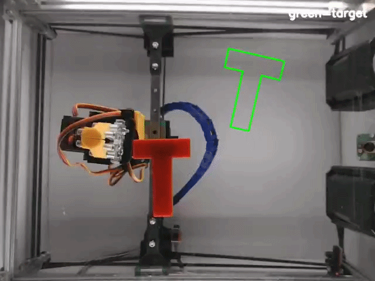
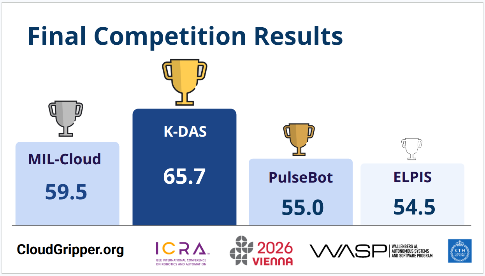

# RGMC2026 KDAS Solution

This repository contains our solution for the **IEEE ICRA 2026 Cloud Robotics Competition**, which is part of the **11th Robotic Grasping and Manipulation Competition (RGMC 2026)** at IEEE ICRA 2026.

The competition uses [**CloudGripper**](https://github.com/cloudgripper), an open-source cloud robotics testbed, where teams develop manipulation algorithms through remote access to robotic arm cells. The 2026 Cloud Robotics track focuses on generalization and robustness across different robot cells, object properties, calibration differences, and unseen evaluation cases.

Our solution addresses the two competition tasks:

* **Task 1: Planar Pushing** — pushing objects toward target poses.
* **Task 2: Linear Deformable Object Shape Control** — controlling rope-like objects to match target shapes.

Check the links below for additional information:

[CloudGripper](https://github.com/cloudgripper)

[Competition page](https://sites.google.com/view/rgmcomp)

## Task 1: Planar Pushing

For Task 1, our solution uses a closed-loop planar pushing strategy to move an object toward a target pose, including both position and orientation. Instead of executing a single large push, the system repeatedly observes the object state, generates multiple candidate pushing actions, predicts their effects with a one-step physics model, and selects the action that best moves the object along a reference path toward the target.

Each push candidate is generated from the object boundary and evaluated using predicted translation, rotation, progress toward the target, and shape overlap with the goal pose. The system also checks whether the robot can safely reach the selected pushing start point before execution. Approach paths are tested from simple to complex: straight-line path, L-shaped path, U-shaped path, and finally A* search when necessary.

The execution loop consists of approach, alignment, pushing, retreat, and re-observation. This allows the system to compensate for model error after each action and plan the next push from the updated object pose. Before running on the real robot, the overall pipeline was first validated in a physics-based simulation environment to test candidate generation, prediction, scoring, and path planning.

## Task 2: Linear Deformable Object Shape Control

For Task 2, our solution addresses linear deformable object shape control, where the goal is to manipulate a rope-like object so that its final shape matches a given target configuration. Unlike Task 1, this task is not a rigid-body pose-matching problem; the rope must be controlled as an ordered sequence of nodes, where both node positions and local tangent directions affect the final shape.

Our approach represents the rope as a 20-node deformable chain and combines physics-based modeling, learning-based prediction, and runtime safety correction. We first used a Discrete Elastic Rod (DER)-based model to capture basic rope behavior such as length constraints, bending resistance, damping, and fixed-end constraints. Since the pure physics model could not fully capture real-world effects such as friction, contact uncertainty, and perception noise, we added a Residual GNN to correct the DER prediction error.

Using the hybrid DER + Residual GNN model, we generated teacher actions with Model Predictive Control (MPC). The controller evaluates candidate actions by predicting how each grasp-and-drag operation changes the rope shape, then selects the action that best reduces the error to the target. We extended the initial one-step MPC into a two-step MPC to make the teacher more future-aware and reduce the number of steps needed to reach the target shape.

To make execution faster than online MPC, we trained policy models using Behavior Cloning and candidate-aware offline reinforcement learning. The learned policy predicts which rope node to grasp, how far to move it, and in which direction. During real robot execution, the policy output is further refined by a runtime safety layer that checks local rope direction, rotation sign, endpoint behavior, geometry risk, and score preservation.

The final Task 2 pipeline combines physics-informed prediction, residual learning, MPC-based teacher generation, BC/RL policy learning, and geometry-aware runtime correction. This closed-loop structure allows the system to repeatedly observe the rope, select a manipulation action, execute it safely, and re-plan from the updated rope state.

## Results

Evaluation runs for the competition can be seen [here](K-DAS-runs).
